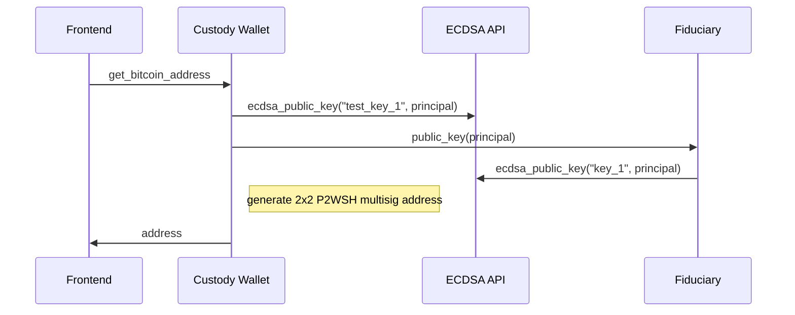
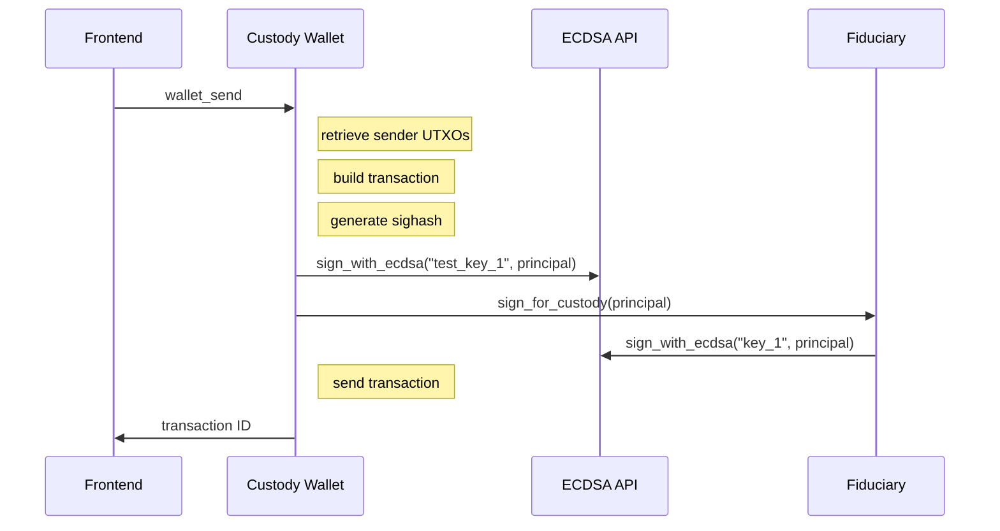

# Multi-subnet wallet on the Internet Computer

## Disclaimer

**USE AT YOUR OWN RISK!**

The following code is provided as-is and has not undergone deep testing or auditing. It is strongly advised not to use this code for transferring real bitcoin funds on the mainnet. The authors and contributors disclaim any responsibility for potential issues or losses resulting from the use of this code.

## Deploy the smart contract to the Internet Computer

The contracts are already deployed on the IC here: https://o3zgr-waaaa-aaaap-abr2q-cai.raw.icp0.io/
To deploy it yourself on the IC (for the Bitcoin testnet), you can inspire yourself from the script install-ic.sh. However note that to install the fiduciary canister on the fiduciary subnet, the only present way to do so is to create the canister with the dfx ledger command:
```dfx ledger create-canister --subnet-type=fiduciary --e8s=50000000 --ic <CONTROLLER>```

## How does it work?

The Internet Computer can be used to create Bitcoin wallets, where the private key never exists physically, but signatures are generated by a secure multi-party computation among the nodes of a subnet. To make such wallet even more secure, we can create P2WSH multi-sig addresses that request signatures generated from different subnets, so that the node providers of these subnets would need to collude to steal the assets. 

### Architecture

The multi-subnet wallet is composed of two backend canisters: the custody wallet canister and the fiduciary canister.
The custody wallet is the main canister. It interfaces with the bitcoin API to get the balance, query the UTXOs and send transactions. It also contains the logic that orchestrate the creation of the bitcoin addresses and the building of transactions.
The fiduciary canister is a very simple canister which creates public key or signs message hashes for the custody wallet.

### Flow

The custody wallet canisters generates 2x2 multisig bitcoin P2WSH addresses based on two public keys:
 - the first pk is generated by the custody wallet itself, directly calling the ecdsa_public_key method with the key name "test_key_1"
 - the second pk is generated by the fiduciary canister, which also calls the ecdsa_public_key method but with a different key name (hard-coded to "key_1")

The principal's caller is used for derivation path so that a unique bitcoin address and signature are derived for each user.

#### Address creation flow



When a new address is generated for a user, the custody wallet canister keeps in memory the witness script that has been used to generate the address for that user. When the user sends funds from that address, the associated script is used to generate the sighash which, once signed by both canisters, is used as witness to create valid transaction inputs.

#### Withdrawal flow



## Notes

 - The fee to sign_with_ecdsa is set to 25 billions (contrary to the 10 billions found in the dfinity btc example) otherwise the ecdsa signature sometimes failed with insufficient cycles error.

## Pending improvements

 - Pre-upgrade, save CustodyData in stable memory to restore it after the upgrade
 - Add an estimation of the fee to send bitcoins in the UI
 - Allow the user to change the bitcoin network live
 - Allow each user to have multiple accounts (e.g. incremental suffix added to principal for the derivation path)
 - Test on Bitcoin mainnet
 - Audit, black-hole, create verifiable wasm hash

## Credits

 - The custody wallet code is based on the https://github.com/rust-bitcoin/rust-bitcoin/tree/master from Dfinity
 - Some of the welcome page designs are inspired from https://github.com/rvanasa/vite-react-motoko/tree/main
 - For CSS title glitch effect: https://codepen.io/aldrie/pen/PojGYLo